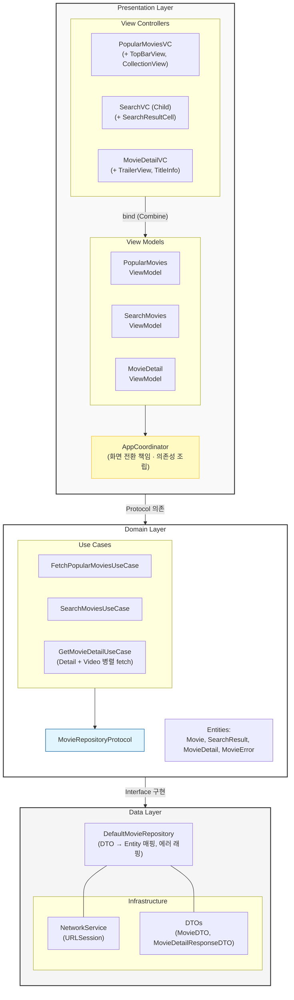

# 🎬 Movie Explorer

TMDB API 기반 영화 탐색 iOS 앱.  
인기 영화 무한 스크롤, 실시간 검색, 상세 정보 및 예고편 재생을 지원합니다.

||||
|---|---|---|

> **iOS 15+** · **Swift** · **Combine** · **MVVM-C** · **Clean Architecture** · **TDD**

## 목차
- [🚀 기술 스택](#-기술-스택)
- [📐 Architecture Overview](#-architecture-overview)
- [🔥 Technical Decisions](#-technical-decisions)
  - [1. 실시간 검색 — 레이스 컨디션 방어와 네트워크 최적화](#1-실시간-검색--레이스-컨디션-방어와-네트워크-최적화)
  - [2. 무한 스크롤 — 서버 데이터 중복에 대한 방어적 프로그래밍](#2-무한-스크롤--서버-데이터-중복에-대한-방어적-프로그래밍)
  - [3. 이미지 성능 최적화 — 2계층 Prefetch + 다운샘플링](#3-이미지-성능-최적화--2계층-prefetch--다운샘플링)
  - [4. 화면 전환 — Coordinator 패턴을 통한 Navigation 책임 분리](#4-화면-전환--coordinator-패턴을-통한-navigation-책임-분리)
  - [5. 영화 상세 — UseCase 내 API 호출 통합](#5-영화-상세--usecase-내-api-호출-통합)
- [🛠 Troubleshooting](#-troubleshooting)
  - [UIScrollView 내 WKWebView 배치 시 발생하는 재귀적 레이아웃 업데이트 루프 해결](#uiscrollview-내-wkwebview-배치-시-발생하는-재귀적-레이아웃-업데이트-루프-해결)
  - [커스텀 레이아웃 환경에서의 UISearchController 충돌 해결](#커스텀-레이아웃-환경에서의-uisearchcontroller-충돌-해결)
  - [CAGradientLayer의 동적 크기 갱신 지연 해결](#cagradientlayer의-동적-크기-갱신-지연-해결)
- [✅ 테스트](#-테스트)
- [📁 프로젝트 구조](#-프로젝트-구조)

## 기술 스택

| 카테고리 | 기술 |
|---|---|
| **아키텍처** | Clean Architecture + MVVM-C (Coordinator) |
| **비동기/바인딩** | Combine (`@Published`, `PassthroughSubject`), Swift Concurrency (`async/await`) |
| **UI** | UIKit (코드 베이스), UICollectionViewCompositionalLayout, DiffableDataSource |
| **네트워크** | URLSession 기반 자체 NetworkService |
| **이미지** | Kingfisher (2-Tier 캐싱, Prefetch, 다운샘플링) |
| **레이아웃** | SnapKit |
| **테스트** | XCTest, MockURLProtocol 기반 네트워크 테스트 |

---

## Architecture Overview



**핵심 규칙**: 의존성은 항상 안쪽(Domain)을 향합니다. Domain 레이어에는 `import UIKit`이 존재하지 않으며, Data 레이어의 DTO 객체는 `toDomain()` 매핑을 거쳐 Presentation으로 전달됩니다.

---

## 🔥 Technical Decisions

### 1. 실시간 검색 — 레이스 컨디션 방어와 네트워크 최적화

**문제 상황**  
실시간 검색은 사용자 타이핑마다 API를 호출하므로 두 가지 문제가 발생합니다.
- 불필요한 네트워크 요청이 폭증하여 서버 부하 증가
- 느린 응답(예: "어벤"에 대한 요청)이 빠른 응답("어벤져스")보다 늦게 도착하면, 최신 결과를 과거 결과가 덮어씌우는 **레이스 컨디션** 발생

**해결 방안 및 근거** (`SearchMoviesViewModel.swift`)
```swift
// 1단계: Combine 파이프라인으로 입력 최적화
searchQuerySubject
    .debounce(for: .milliseconds(300), scheduler: DispatchQueue.main)  // 타이핑 종료 후 300ms 대기
    .removeDuplicates()  // 동일 쿼리 중복 요청 차단
    .sink { [weak self] query in
        self?.performSearch(query: query)
    }

// 2단계: Task 취소를 통한 레이스 컨디션 방어
private func performSearch(query: String) {
    searchTask?.cancel()   // 이전 요청 즉시 취소
    searchTask = Task {
        let results = try await searchMoviesUseCase.execute(query: query)
        if !Task.isCancelled {   // 취소된 Task의 결과가 UI를 오염하지 않도록 이중 방어
            self.searchResults = results
        }
    }
}
```

❗추가로 `SearchMoviesUseCase`에서는 한글 입력 특성 및 초성을 하나의 검색어로 인식하는 서버 특성을 고려하여, 쿼리 마지막에 아직 조합이 끝나지 않은 단일 자음/모음(`ㄱ`~`ㅎ`, `ㅏ`~`ㅣ`)을 제거하여 무의미한 API 호출을 한 번 더 차단합니다.

**결과**  
디바운싱 → 중복 제거 → Task 취소 → 자음/모음 필터링의 4중 방어 파이프라인을 통해, 불필요한 네트워크 호출을 최소화하면서도 최신 쿼리에 대한 응답만 UI에 반영되는 것을 보장합니다.

---

### 2. 무한 스크롤 — 서버 데이터 중복에 대한 방어적 프로그래밍

**문제 상황**  
TMDB API의 페이지네이션 응답에서, 15페이지 마지막 아이템과 16페이지 첫 번째 아이템이 동일한 영화('니모를 찾아서')로 내려오는 서버 측 오류가 실제로 발생했습니다. `DiffableDataSource`는 아이템의 고유성을 전제로 동작하므로, 중복 아이템이 삽입되면 런타임 크래시가 발생합니다.

**해결 방안 및 근거** (`PopularMoviesViewModel.swift`)
```swift
private var idSet: Set<Int> = []

func fetchNextPage() async {
    let result = try await fetchPopularMoviesUseCase.execute(page: nextPage)
    let newMovies = result.movies.filter { !idSet.contains($0.id) }  // O(1) 중복 필터링
    newMovies.forEach { idSet.insert($0.id) }
    movies.append(contentsOf: newMovies)
}
```
`Set<Int>`를 사용해 이미 표시한 영화 ID를 O(1)으로 조회하여, 서버의 중복 데이터가 `DiffableDataSource`로 유입되는 것을 차단합니다.

**결과**  
서버 응답을 맹신하지 않는 방어적 코드를 통해, 서버 측 페이지네이션 오류가 발생하더라도 앱 크래시 없이 안정적으로 무한 스크롤이 동작합니다.

---

### 3. 이미지 성능 최적화 — 2계층 Prefetch + 다운샘플링

**문제 상황**  
영화 포스터 그리드에서 빠르게 스크롤하면 이미지 로딩 지연이 발생하고, 원본 해상도의 이미지가 메모리에 적재되면 대량의 메모리를 소비합니다.

**해결 방안 및 근거** (`PopularMoviesViewController.swift`)
- **엔티티 데이터 Prefetch**: `willDisplay` 시점에 현재 아이템이 전체 데이터의 끝에서 4개 이내일 때 다음 페이지를 미리 요청합니다. `prefetchItemsAt` 대신 `willDisplay`를 선택한 이유는, 전자가 시스템 예측 기반인 반면 후자는 실제 표시 시점을 기준으로 하므로 빠른 스크롤 시 데이터가 아예 도착하지 못하는 엣지 케이스를 방지할 수 있기 때문입니다.
- **이미지 Prefetch**: `UICollectionViewDataSourcePrefetching`에서 Kingfisher의 `ImagePrefetcher`를 활용하여, 곧 화면에 진입할 셀의 이미지를 디스크/메모리 2-Tier 캐시에 미리 적재합니다.
- **다운샘플링**: 네트워크 요청 시 디바이스 화면 크기에 맞는 해상도(iPhone: w500, iPad: w780)를 선택하고, UI 렌더링 시 Kingfisher의 다운샘플링 프로세서로 셀 크기에 맞게 한 번 더 축소합니다.
  - ❗해상도 근거
    - iPhone: 아이폰 가로 해상도 약 1200, 기본 배치에서 그 1/3인 400을 필요로 하므로 그 이상의 옵션을 선택
    - iPad: 13인치 가로 해상도 약 2000, 기본 배치에서 그 1/3인 약 660을 필요로 하므로 그 이상의 옵션을 선택

**결과**  
네트워크 레벨과 UI 레벨에서 각각 최적화된 해상도를 적용하여, 데이터 전송량과 메모리 사용량을 동시에 절감하면서도 스크롤 시 이미지가 즉시 표시됩니다.

---

### 4. 화면 전환 — Coordinator 패턴을 통한 Navigation 책임 분리

**문제 상황**  
ViewController 내부에서 직접 화면 전환(`push`, `present`)을 수행하면, ViewController 간 강결합이 발생하고 화면 흐름 변경 시 여러 파일을 수정해야 합니다.

**해결 방안 및 근거** (`AppCoordinator.swift`)
```swift
// ViewController는 이벤트만 외부로 전달
vc.onMovieSelected = { [weak self] movieId in
    self?.showMovieDetail(movieId: movieId)
}
vc.onInfoTapped = { [weak self] in
    self?.showAppInfo()
}
```
ViewController는 `onMovieSelected`, `onInfoTapped` 같은 클로저로 사용자 인터랙션을 알리기만 하고, 실제 `UINavigationController.pushViewController`나 `present` 호출은 `AppCoordinator`가 전담합니다.

**결과**  
ViewController가 다음 화면의 존재를 알 필요가 없으므로, 딥링크 대응이나 화면 흐름 변경 시 Coordinator만 수정하면 됩니다. 또한 ViewController의 Unit Test에서 Navigation 로직을 분리하여 테스트할 수 있습니다.

---

### 5. 영화 상세 — UseCase 내 API 호출 통합

**문제 상황**  
영화 상세 화면은 상세 정보 API(`/movie/{id}`)와 예고편 API(`/movie/{id}/videos`) 두 개의 엔드포인트를 호출해야 합니다. ViewModel에서 각각 호출하면 두 개의 비동기 상태를 관리해야 하고, Presentation 레이어에 데이터 조합 로직이 노출됩니다.

**해결 방안 및 근거** (`GetMovieDetailUseCase.swift`)
```swift
func execute(id: Int) async throws -> MovieDetail {
    async let fetchedDetail = movieRepository.fetchMovieDetail(id: id)
    async let fetchedYoutubeKey = try? movieRepository.fetchYoutubeKey(id: id)

    let detail = try await fetchedDetail
    let youtubeKey = await fetchedYoutubeKey

    return MovieDetail(/* detail 필드 + youtubeKey 병합 */)
}
```
`async let`으로 두 API를 병렬 호출하고, UseCase 내부에서 하나의 `MovieDetail` 엔티티로 병합합니다. 예고편 API 실패 시에는 `try?`로 graceful하게 처리하여 상세 정보 표시에 영향을 주지 않습니다.

**결과**  
ViewModel은 단일 `state` 프로퍼티(`idle → loading → loaded | error`)만 관리하면 되므로, 상태 관리가 단순해지고 계층 간 역할 분리가 명확해집니다.

---

## Troubleshooting

### UIScrollView 내 WKWebView 배치 시 발생하는 재귀적 레이아웃 업데이트 루프 해결

영화 상세 화면에 유튜브 예고편 웹뷰를 임베드하자 앱이 완전히 멈추는 현상이 발생했습니다.

- **원인 추적**: 웹뷰 크기를 줄여 스크롤이 불필요해지자 정상 동작하는 것을 확인 → ScrollView의 `contentInsetAdjustmentBehavior`가 ContentView 크기를 조정할 때마다 WKWebView가 리렌더링되고, 이것이 다시 레이아웃 갱신을 트리거하는 무한 루프가 원인
- **해결**: `scrollView.contentInsetAdjustmentBehavior = .never`로 설정. ContentView를 Safe Area Layout Guide에 맞춰 배치했으므로 여백 이슈 없음

### UISearchController 레이아웃 충돌

커스텀 `TopBarView` 환경에서 `UISearchController`를 사용하면, 활성화 시 SearchBar가 화면 밖으로 이탈하는 문제가 발생했습니다.

- **원인**: `UISearchController`는 자체적으로 `searchBar`의 위치를 제어하므로, `navigationItem` 없이 배치하면 레이아웃 제약이 충돌
- **해결**: 일반 `UISearchBar` + `SearchViewController`를 Child ViewController로 구성하여 완전한 레이아웃 제어권 확보

### CAGradientLayer 동적 크기 적용

백드롭 이미지 위에 그라디언트 오버레이를 적용할 때, `CAGradientLayer`는 Auto Layout과 독립적으로 동작하여 초기 frame이 `.zero`인 문제가 있었습니다.

- **해결**: `viewDidLayoutSubviews()` 시점에 `gradientLayer.frame`을 이미지 뷰의 `bounds`에 맞춰 갱신

---

## 테스트

프로토콜 기반 의존성 주입 구조를 활용하여, 각 계층별로 Mock 객체를 주입한 Unit Test를 작성했습니다.

| 계층 | 테스트 파일 | 주요 검증 항목 |
|---|---|---|
| **Data** | `DefaultMovieRepositoryTests` | Endpoint 생성, DTO→Entity 매핑, 에러 래핑 (11건) |
| **Data** | `NetworkServiceTests` | URLRequest 조립, 상태 코드 에러, 디코딩 검증 |
| **Domain** | `FetchPopularMoviesUseCaseTests` | 페이지 유효성, Repository 결과/에러 전파 (3건) |
| **Domain** | `SearchMoviesUseCaseTests` | 자음/모음 탈락, 트리밍, popularity 정렬 (9건) |
| **Domain** | `GetMovieDetailUseCaseTests` | 상세+영상 병합, 에러 전파 |
| **Presentation** | `PopularMoviesViewModelTests` | 페이지네이션, 중복 제거, 에러 메시지, 로딩 가드 (5건) |
| **Presentation** | `SearchMoviesViewModelTests` | 디바운싱, removeDuplicates, clearQuery (4건) |
| **Presentation** | `MovieDetailViewModelTests` | 상태 전이(idle→loading→loaded\|error) |

Mock 객체: `MockMovieRepository`, `MockNetworkService`, `MockFetchPopularMoviesUseCase`, `MockSearchMoviesUseCase`, `MockGetMovieDetailUseCase`, `MockURLProtocol`

---

## 프로젝트 구조

```
MovieExplorer/
├── App/
│   ├── AppCoordinator.swift          # 화면 전환 · 의존성 조립
│   ├── SceneDelegate.swift
│   └── APIKey.swift                  # gitignore 관리
├── Domain/
│   ├── Entities/                     # Movie, SearchResult, MovieDetail, MovieError
│   ├── Interfaces/                   # MovieRepositoryProtocol
│   └── UseCases/                     # FetchPopular, Search, GetDetail
├── Data/
│   ├── DTOs/                         # MovieResponseDTO, MovieDetailResponseDTO, VideoResponseDTO
│   ├── Network/                      # NetworkService, APIEndpoint, ImageURLMapper
│   └── Repositories/                 # DefaultMovieRepository (DTO→Entity, 에러 래핑)
├── Presentation/
│   ├── PopularMovies/                # VC, ViewModel, Cell, TopBarView
│   ├── SearchMovies/                 # VC, ViewModel, SearchResultCell
│   └── MovieDetail/                  # VC, ViewModel, TrailerView, TitleInfoView, GenreTagView
└── Global/
    └── Preview+.swift

MovieExplorerTests/
├── Data/                             # Repository, NetworkService 테스트
├── Domain/                           # UseCase 테스트
├── Presentation/                     # ViewModel 테스트
└── Mocks/                            # 6개 Mock 객체
```
## API


This product uses the TMDB API but is not endorsed or certified by TMDB.
